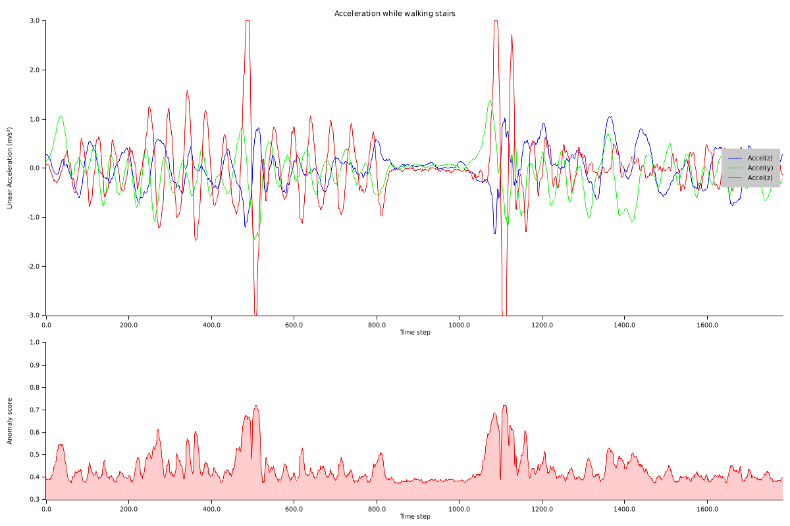

# Extended Isolation Forest

[](https://crates.io/crates/extended-isolation-forest) [](https://deps.rs/repo/github/nmandery/extended-isolation-forest)

This is a rust port of the anomaly detection algorithm described in [Extended Isolation Forest](https://doi.org/10.1109/TKDE.2019.2947676)
and implemented in [https://github.com/sahandha/eif](https://github.com/sahandha/eif). For a detailed description see the paper or the
github repository.

This crate requires rust >= 1.51 as it makes use of `min_const_generics`.

Includes optional serde support with the `serde` feature.

## Example

```rust
use rand::distributions::Uniform;
use rand::Rng;
use extended_isolation_forest::{Forest, ForestOptions};

fn make_f64_forest() -> Forest<f64, 3> {
    let rng = &mut rand::thread_rng();
    let distribution = Uniform::new(-4., 4.);
    let distribution2 = Uniform::new(10., 50.);
    let values: Vec<_> = (0..3000)
        .map(|_| [rng.sample(distribution), rng.sample(distribution), rng.sample(distribution2)])
        .collect();

    let options = ForestOptions {
        n_trees: 150,
        sample_size: 200,
        max_tree_depth: None,
        extension_level: 1,
    };
    Forest::from_slice(values.as_slice(), &options).unwrap()
}

fn main() {
    let forest = make_f64_forest();

    // no anomaly
    assert!(forest.score(&[1.0, 3.0, 25.0]) < 0.5);
    assert!(forest.score(&[-1.0, 3.0, 25.0]) < 0.5);

    // anomalies
    assert!(forest.score(&[-12.0, 6.0, 25.0]) > 0.5);
    assert!(forest.score(&[-1.0, 2.0, 60.0]) > 0.5);
    assert!(forest.score(&[-1.0, 2.0, 0.0]) > 0.5);
}
```

## Example: Detection anomalies in movement recordings

This example uses acceleration data recorded using a smartphone while walking up and down stairs. The anomaly was 
caused by a small jump. The code is in `[examples/walking_stairs.rs](examples/walking_stairs.rs)`, the data itself
is in `[data/acceleration](data/acceleration)`. All data for this example was collected with the [phyphox smartphone app](https://phyphox.org/). 

The example can be executed using

```
cargo run --example walking_stairs
```

Expected result:



